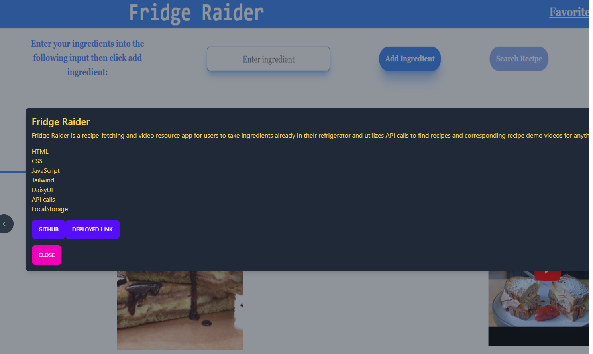
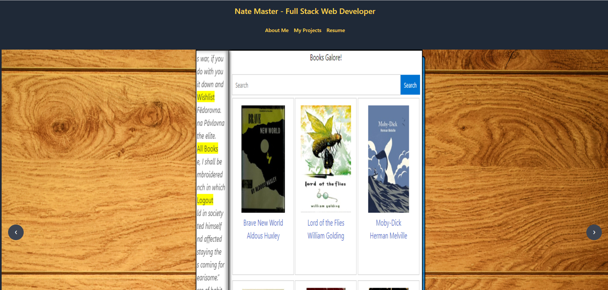

# React Portfolio
    
## Description
Many developers have to find ways that showcase their work, and a personal web portfolio is a great way to do that! Earlier in my development career, I crafted a simple one using only vanilla HTML, CSS, and JS. It was very cool to use more advanced technology to display my newest project.

I wanted to show off how many more languages I'd learned and skills I could show, so I utilized react, specifically the react router, to create a much more functional and responsive web-page. I also relied heavily on an external CSS library called Tailwind that is highly utilized, especially in conjunction with react.
    
## Table of Contents
- [Installation](#installation)
- [Resources](#resources)
- [Usage](#usage)
- [Questions](#questions)

## Installation
The project is a deployed website and does not require any installation.

## Resources
Here is a link to my deployed application:

Application Link: [Your Application Link](https://www.example.com)

Here are a few images of the portfolio:

## Usage
Click the link and check my work out! I will say, however, the coolest part is my portfolio carousel which highlights my projects. You can scroll from project to project, but also click on the image to get a description of my project, the components, and access to the deployed app and/or GitHub repository.

## Questions
Do you still have questions or further inquiries? Reach out to me on GitHub at [http://github.com/natejmaster](http://github.com/natejmaster) or e-mail me at natejmaster@gmail.com.
